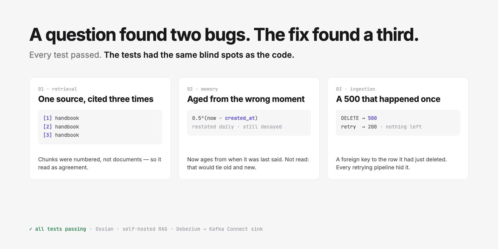

# A question on Discord found two bugs in my RAG system. Fixing them found a third.

*Every test passed. The tests had the same blind spots as the code.*



---

A developer saw Ossian's MCP server in a community showcase and asked two questions:

> How do you handle cases where retrieved docs and stored memories conflict? Or when multiple
> pieces of context ultimately come from the same underlying source?

I had a confident answer to both. Documents and agent memory live in separate tables, are reached
through separate tools, and never meet in a prompt. Duplicates are caught at ingest by content hash.
Done.

Before replying I read the code to make sure the answer was true. It was half true, and the half
that wasn't is the interesting part.

## Bug one: three passages looked like three sources

Retrieval returns chunks, not documents. Ossian took the top six and numbered them for the model,
so a prompt could look like this:

```
[1] engineering-handbook.txt  …
[2] engineering-handbook.txt  …
[3] engineering-handbook.txt  …
[4] platform-architecture.md  …
```

To the model — and to the person reading the citations — that is three sources agreeing and one
dissenting. It is one source said three times. The system prompt even tells the model *"if the
context conflicts with itself, say which sources disagree"*, and there was no way for it to tell one
source from several.

Ingest-time deduplication does nothing here. These are distinct chunks of one legitimate document.

The fix groups chunks by document id before the prompt is built: one number per document, every
passage kept under it, the document ranked by its best chunk. Two files that merely share a filename
stay separate, because the grouping is on id. On a live question, six retrieved chunks now become
five citations, with one runbook contributing two passages under a single number.

## Bug two: memory decayed from the wrong moment

Agent memory is ranked `similarity × importance × 0.5^(age / 30 days)`. Recency matters for memory in
a way it never does for documents: a runbook from three years ago is as true as one from today, a
stated preference from three years ago is not.

The question is what "age" means. The query measured it from `created_at`.

An agent that restates a fact — "the user still prefers British English" — hits a deduplicating
upsert, which updates `updated_at` and nothing the ranking reads. A preference confirmed every day
for three months decayed exactly as if it had been said once, three months ago.

The obvious fix is wrong. Recall already records `last_used_at`, and a comment on it claimed that
recording use *"keeps a live memory from decaying away."* It didn't — and it shouldn't. Recall
returns everything that matches, so an old preference and the newer one contradicting it are
recalled *together*. Refresh both on read and they tie on recency, which is the one signal that
lets the newer one win.

So age now runs from the last time something was **said**, not the last time it was **read**.
Measured against the running system, after three recalls of both:

| Memory | Score |
|---|---|
| "switched the editor to the light theme" (fresh) | 0.765 |
| "prefers the dark theme" (90 days old) | 0.102 |
| …then the dark-theme preference is restated | 0.817 |

The test suite had a recency test, and it passed the whole time. It backdated `created_at` — the
same column the bug read. The test and the code shared an assumption, so the test could only ever
confirm it. The new test fails against the old query; I checked by putting the old line back.

## Bug three: found by building the next thing

With those fixed, I built what I'd meant to build anyway: a Kafka Connect sink, so a table that
Debezium streams into Kafka becomes a corpus that follows the database.

Its first end-to-end run showed a batch of changes failing with HTTP 500, twice, then succeeding on
the third attempt. The sink's backoff did its job. The backend's log said:

```
insert or update on table "ingest_events" violates foreign key constraint
Key (document_id)=(…) is not present in table "documents".
```

A `DELETE` event removed the document, then recorded the event row pointing at the id it had just
deleted. The foreign key rejected it. Because the batch loop didn't catch it, every event in the
batch failed with it.

And it only happened once per document. The retry found nothing to delete, recorded a null id, and
succeeded. Any pipeline that retries — which is every pipeline worth running — hid it completely.
There were no tests for the event API at all, so nothing else was going to.

## Building the sink

A few decisions that are easy to get wrong:

**The event id comes from Kafka, not from Debezium.** Ossian's event API is idempotent on a
caller-supplied id, so the sink needs one that is stable under redelivery. Debezium's source position
looks ideal and isn't: every row of an initial snapshot shares one LSN, so two different rows would
collapse into one id and the second would be silently discarded as a duplicate. The sink uses the
connector name, topic, partition and offset, plus the record timestamp to survive a topic being
recreated with offsets starting from zero.

**A blanked row is removed, not skipped.** If an update empties every text column, leaving the old
document in place means the corpus keeps answering from text the source no longer has. If *none* of
the configured columns exist on the record, though, it's rejected as a misconfiguration — otherwise a
typo in `ossian.text.fields` deletes the whole table from the corpus.

**Placeholders are refused.** With Postgres' default replica identity, an update that doesn't touch
a large column sends Debezium's `__debezium_unavailable_value` instead of the text. Indexing that
would replace a real article with a sentinel string.

**Offsets never move ahead of delivery.** `put()` is synchronous. Rate limits and 5xx back off using
`Retry-After` and retry; a record Ossian rejects goes to the dead-letter queue while the rest keep
flowing; a 401 stops the task, so a bad key can't drain an entire topic into the DLQ.

End to end against a Postgres table: a snapshot of three rows became three documents answerable with
citations; an update from 180 to 90 days changed the answer and left no old chunk still saying 180;
a delete removed the document and its chunks; a blanked row disappeared; and resetting the sink's
offsets replayed the whole topic — 18 events before, 18 after, no new documents.

## What's still open

The original question isn't fully answered, and I said so in the reply.

Memories have no link back to the document they were learned from, so a memory that goes stale when
its source document changes is never flagged. And deduplication is exact: "prefers dark mode" and
"likes dark mode" both persist, and a contradicting memory doesn't supersede the older one — both come
back, and recency decides. Keeping documents and memory apart is staying. The rest is an
[open design discussion](https://github.com/dockndevai/ossian/issues/3).

## The lesson I keep relearning

None of these three were exotic. Each survived because something *around* it agreed with it: a test
that backdated the same column the query read, a citation format that looked right in every
screenshot, a retry loop that turned a deterministic failure into a transient one.

The fastest way I know to find that kind of bug is to explain the system to someone who asks a
precise question — and check the code before you hit send.

---

*Ossian: [dockndevai.github.io/ossian-site](https://dockndevai.github.io/ossian-site/) ·
[github.com/dockndevai/ossian](https://github.com/dockndevai/ossian) ·
Kafka Connect sink: [github.com/dockndevai/ossian-kafka-connect](https://github.com/dockndevai/ossian-kafka-connect) ·
Issues: [#1](https://github.com/dockndevai/ossian/issues/1),
[#2](https://github.com/dockndevai/ossian/issues/2),
[#5](https://github.com/dockndevai/ossian/issues/5)*

*Written with Claude (Anthropic), working in the codebase it describes; every number and code sample
was verified against the running system. Reviewed and published by
[@dockndevai](https://github.com/dockndevai).*
